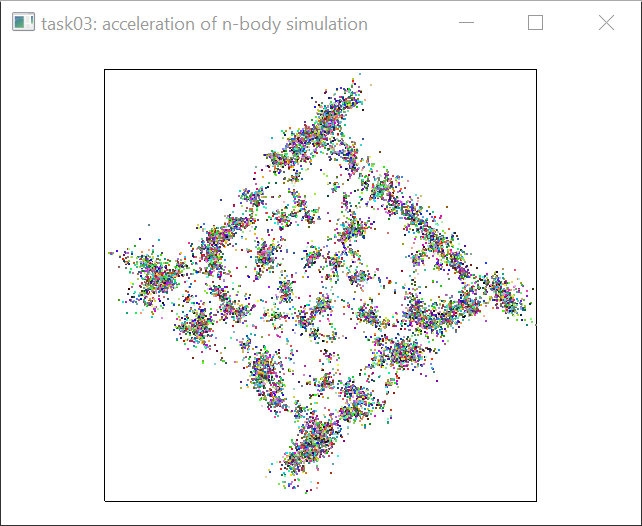

# Task03: Acceleration of N-body Simulation


**Deadline: March 11th (Thu) at 15:00pm**

----

## Before Doing Assignment

If you have not done the [task00](../task00), do it first to set up the C++ graphics development environment.

Follow [this document](../doc/submit.md) to submit the assignment, In a nutshell, before doing the assignment,

- install `eigen` library following  [this document](../doc/setup_eigen.md)
- make sure you synchronized the `main ` branch of your local repository  to that of remote repository.
- make sure you created branch `task03` from `main` branch.
- make sure you are currently in the `task03` branch (use `git branch -a` command).

Now you are ready to go!

---

## Problem 1

This program is computationally expensive. Build the program with ***Release*** mode to make the program run faster.  
Configure the project with 
```bash
cmake -DCMAKE_BUILD_TYPE=Release ..
```
instead of
```bash
cmake ..
```

Then, run the code and wait until program stops update (`200` steps).
At the end, the program print out the computation time.

This program computes [n-body simulation](https://en.wikipedia.org/wiki/N-body_simulation), where the particles move while attracting each others.

Run the program with different numbers of the particles (5k, 10k, and 20k).
The number of the particle can be set at `line #189`  in [main.cpp](main.cpp).
Record the computation time by filling the table below.     

| #particle | time |
| --- | --- |
| 5000 | 10712ms |
| 10000 | 41616ms |
| 20000 | 169008ms |


Take a screenshot image (it should look like image at the top) after 200 steps for the 20k particles. 
Save the screenshot image overwriting `task03/problem1.png`


## Problem 2

The current code compute the n-body simulation in the brute-force way. 
This is expensive as the computational cost is O(N^2). 
Let's accelerate the computation using the spatial hash grid.

Based on the [Barnes-Hut simulation](https://en.wikipedia.org/wiki/Barnes%E2%80%93Hut_simulation), 
we separate the near field influence and far field approximation.

Each grid has representative particle at the center of the gravity of the particles in that grid.
The representative particle has all the weights of the particles in the grid. 
The force from a far particle is approximated by the force from the representative particle of the grid the particle belong.

Comment out `line #215` and uncomment `line #216` to switch to the accelerated computation.
We use the jagged array data structure to efficiently find the particles inside a grid.
Modify the code around `line #172` to compute the force from particles in far grid.

Run the program with different numbers of the particles (5k, 10k, and 20k). 
Record the computation time by filling the table below.

| #particle | time |
| --- | --- |
| 5000 | 3340ms |
| 10000 | 5399ms |
| 20000 | 12303ms |

With the simulation with 20k particles, run the program for 200 steps. 
Then save the screenshot image, overwriting `task03/problem2.png`.




## After Doing the Assignment

After modifying the code, push the code and submit a pull request.


## Notes

- Do not submit multiple pull requests. Only the first pull request is graded
- Do not close the pull request by yourself. The instructor will close the pull request
- If you mistakenly merge the pull request, it's OK, but be careful not to merge next time. 
